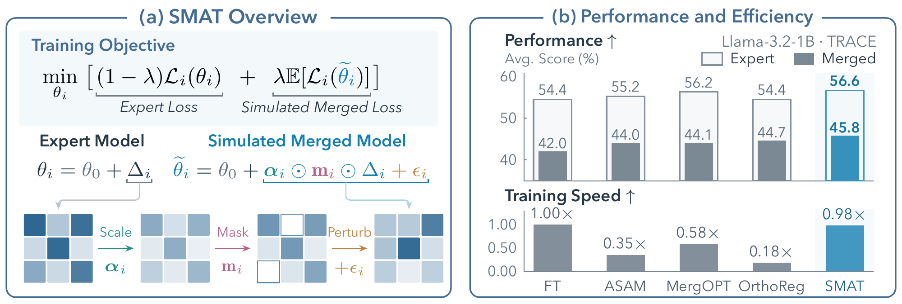

# SMAT: Simple and Efficient Merge-Aware Training

Official implementation of **SMAT: Simple and Efficient Merge-Aware Training**.

[](https://arxiv.org/abs/2609.33437)
[Hugging Face models & data](docs/HUGGINGFACE.md) · [Paper PDF](https://arxiv.org/pdf/2609.33437) · [Setup & data](docs/DATA.md) · [Running experiments](docs/RUNNING.md) · [Citation](#citation)

**Train experts that merge better, with less than 2% training-time overhead.**

**Yanggan Gu¹\*, Yuanyi Wang¹\*, Zhen Li¹, Shuo Cai¹, Yuhang Liu¹,
Junzhuo Li², Zihao Wang³, Hongxia Yang<sup>1,4,5,†</sup>**

¹ The Hong Kong Polytechnic University (PolyU)<br>
² The Hong Kong University of Science and Technology (Guangzhou)<br>
³ The Chinese University of Hong Kong<br>
⁴ PolyU-Daya Bay Technology and Innovation Research Institute<br>
⁵ InfiX.ai

\* Equal contribution. † Corresponding author: [Hongxia Yang](mailto:hongxia.yang@polyu.edu.hk).

Training, merging and evaluation code for FT and SMAT with Llama-1B/8B and
CLIP ViT-B/32/L/14. Supported mergers: WA, TA, TIES, DARE and DELLA.

## Overview

Fine-tuning an expert on its own task does not ensure that it will work well after
merging. **SMAT prepares each expert for merging during training**, by simulating
how a merger may transform its parameter update. Experts still train independently;
other experts' checkpoints are not needed.

[](https://arxiv.org/pdf/2609.33437)

*Figure 1 from the paper. Left: simulated merged states during expert training.
Right: merged performance and training speed compared with the baselines.*

### How it works

Starting from pretrained weights, SMAT applies three operations to simulate a
merged model:

| Operation | What it simulates | During training |
| --- | --- | --- |
| **Scale** | A merger changes an expert's contribution. | Randomly scale the expert's parameter update. |
| **Mask** | A merger removes selected update coordinates. | Randomly drop coordinates and rescale those retained. |
| **Perturb** | Other experts contribute additive updates. | Add sampled parameter noise. |

SMAT optimizes both the ordinary expert loss and the expected loss at these
simulated weights. In the default four-step cycle, **three steps use the expert
weights and one uses simulated merged weights**. Each step needs only one forward
and one backward pass. Fused Triton kernels and reusable parameter buffers keep
the extra work small.

After training, merge the experts with **WA, TA, TIES, DARE, or DELLA** using the
commands below. SMAT changes expert training; the chosen merger combines the
resulting checkpoints as usual.

### Results at a glance

Across Llama-1B, Llama-8B, CLIP ViT-B/32, and CLIP ViT-L/14, the paper reports:

- **+1.07–2.16 points** in the mean score across five merging methods, compared
  with the strongest baseline for each backbone.
- **Less than 2% training-time overhead** relative to standard fine-tuning.

See the [paper](https://arxiv.org/abs/2609.33437) for per-backbone results,
ablations, and measurement details.

## Try it on a CPU

[Open the demo notebook](examples/smat_image_demo.ipynb) ·
[Run in Colab](https://colab.research.google.com/github/egangu/smat/blob/main/examples/smat_image_demo.ipynb)

Start with a tiny model pretrained on upright MNIST, train experts for left-
and right-tilted digits, then compare **AVG** and **Task Arithmetic**. The notebook shows SMAT in a short, differentiable PyTorch
implementation, checked against the released eager stepper. Its 26K-parameter
MLP runs on CPU. Across five seeds, all merged models beat the base on both
domains; CPU SMAT gains average **+3.70 points (AVG)** and **+7.05 (TA)**. This
is a controlled domain-shift demo, separate from the paper benchmark and overhead claims. [Recipe, limitations and five-seed results](examples/README.md).

## Released models and data

All [**28 Table 1 experts**](https://huggingface.co/collections/yanggangu/smat-simple-and-efficient-merge-aware-training-6abb7826f636ba703e4f532e) (FT/SMAT × Llama-1B/8B × seven tasks) and the frozen
[TRACE train/dev/eval splits](https://huggingface.co/datasets/yanggangu/SMAT-TRACE)
are available on Hugging Face. Table 2 adds [**32 CLIP vision experts**](https://huggingface.co/collections/yanggangu/smat-simple-and-efficient-merge-aware-training-6abb7826f636ba703e4f532e)
(FT/SMAT × ViT-B/32 and ViT-L/14 × eight tasks) and the frozen
[CLIP8 train/dev/test splits](https://huggingface.co/datasets/yanggangu/SMAT-CLIP8).
See the [download, training and evaluation examples](docs/HUGGINGFACE.md).

## Install

Use Python 3.11, PyTorch 2.11.0+cu130 and CUDA 13.0 on Linux with NVIDIA
GPUs. The paper experiments used H800 GPUs. The supplied 8B configuration uses two GPUs; the other configurations
use one GPU per expert.

```bash
python3.11 -m venv .venv
source .venv/bin/activate
python -m pip install -r requirements/train.txt
python -m pip install -e . --no-deps
# Required for language evaluation:
python -m pip install -r requirements/eval.txt
```

The paper reports Python 3.10.12. This installation recipe uses Python 3.11
because the pinned SciPy 1.17.1 requires Python >=3.11.

## Prepare models and data

Follow [DATA.md](docs/DATA.md) for downloads and split preparation, then set:

```bash
export MODEL_ROOT=/absolute/path/to/models
export DATA_ROOT=/absolute/path/to/prepared-data
export OUTPUT_ROOT=/absolute/path/to/results
```

## Train, merge and evaluate

```bash
export CUDA_VISIBLE_DEVICES=0
python -m smat train-suite configs/main/llama1b_adamw_smat.json
python -m smat merge-suite configs/main/llama1b_adamw_smat.json "$OUTPUT_ROOT/llama1b_smat"
python -m smat eval-suite configs/main/llama1b_adamw_smat.json "$OUTPUT_ROOT/llama1b_smat"
python scripts/summarize.py "$OUTPUT_ROOT/llama1b_smat/summary.json"
```

Use `*_ft.json` for FT, `vitb32_adam_*.json` or `vitl14_adam_*.json` for vision,
and `CUDA_VISIBLE_DEVICES=0,1` for Llama-8B training.
See [RUNNING.md](docs/RUNNING.md) for configuration and command options.

## Quick check

This checks the pipeline with reduced samples and training steps.

```bash
python scripts/smoke.py configs/main/vitb32_adam_smat.json \
  "$OUTPUT_ROOT/smoke_vit" --merge wa ta ties dare della --evaluate
python -m unittest discover -s tests -v
```

The release passed all 60 tests on two H800 GPUs; see the
[validation report](docs/RELEASE_VALIDATION.md) for the environment and scope.

## Layout

- `smat/train/`: FT/SMAT updates, optimizers and GPU kernels.
- `smat/experiments/`: language and vision adapters.
- `smat/merge*.py`, `smat/eval/`: merging and evaluation.
- `configs/`: main configurations, Muon and operator ablation examples.
- `scripts/`, `manifests/`: asset preparation, checksums and split indices.
- `tests/`: numerical and pipeline checks.

See [NOTICE](NOTICE) for third-party attribution. Models and datasets are obtained separately.

## Citation

```bibtex
@misc{gu2026smat,
  title={SMAT: Simple and Efficient Merge-Aware Training},
  author={Gu, Yanggan and Wang, Yuanyi and Li, Zhen and Cai, Shuo and Liu, Yuhang and Li, Junzhuo and Wang, Zihao and Yang, Hongxia},
  year={2026},
  eprint={2609.33437},
  archivePrefix={arXiv},
  primaryClass={cs.LG},
  url={https://arxiv.org/abs/2609.33437}
}
```

The code is available under the [MIT license](LICENSE); model, dataset and third-party
licenses are described in `NOTICE`.
